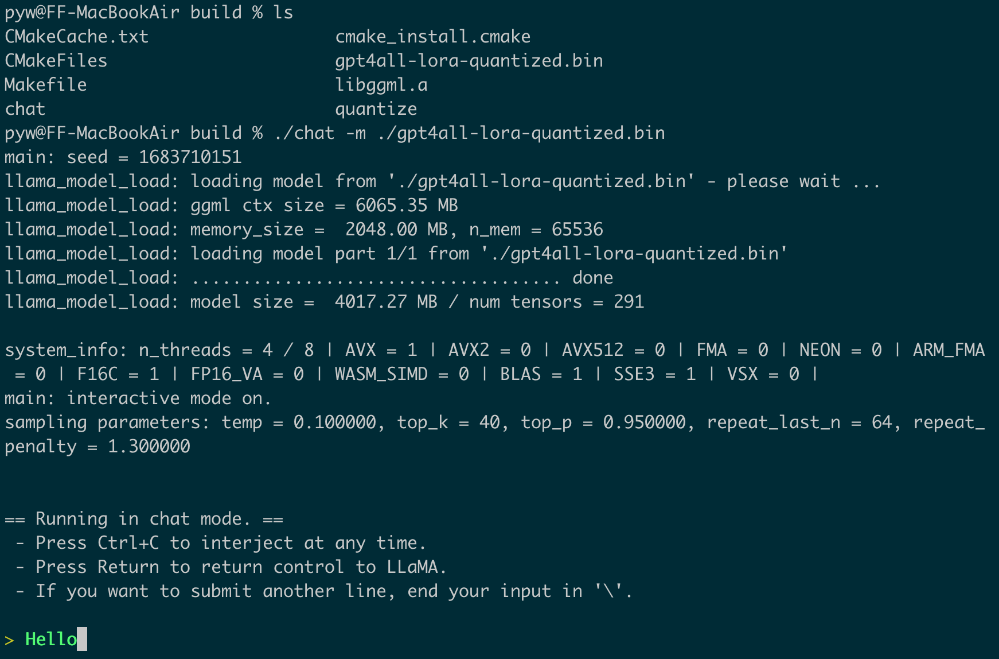
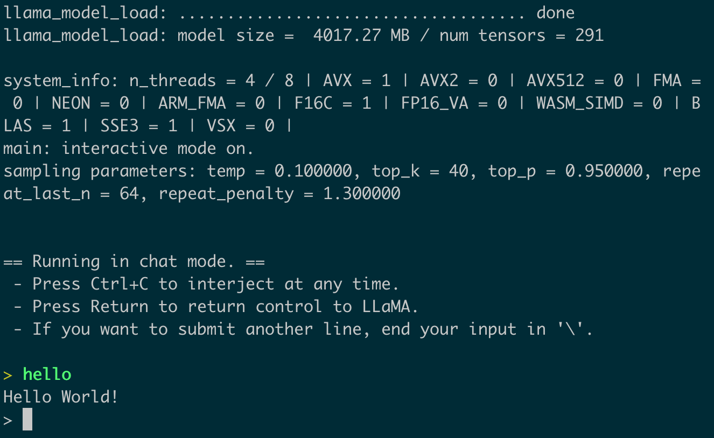
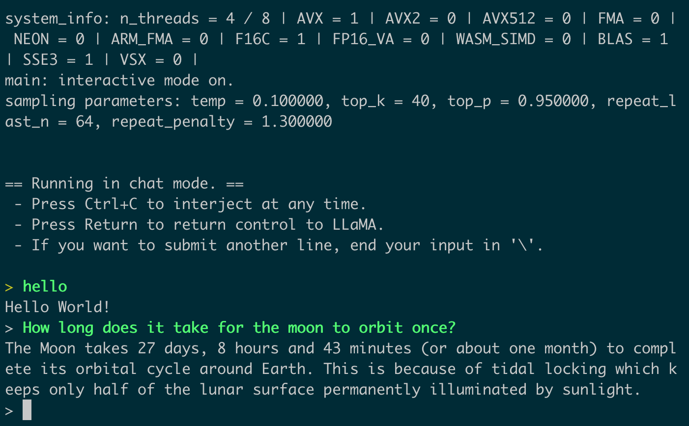

# 跑在笔记本里的大语言模型 - GPT4All

## 何为GPT4All

GPT4All [官网](https://gpt4all.io)给自己的定义是：一款免费使用、本地运行、隐私感知的聊天机器人，无需GPU或互联网。


从官网可以得知其主要特点是：
1. 本地运行（可包装成自主知识产权🐶）
2. 无需GPU（穷人适配）
3. 无需联网（某国也可运行）
4. 同时支持Windows、MacOS、Ubuntu Linux（环境要求低）
5. 是一个聊天工具

## 模型介绍

GPT4All支持多种不同大小和类型的模型，用户可以按需选择。

| 序号  | 模型                              | 许可    | 介绍                                                           |
| --- | ------------------------------- | ----- | ------------------------------------------------------------ |
| 1   | ggml-gpt4all-j-v1.3-groovy.bin  | 商业许可  | 基于GPT-J，在全新GPT4All数据集上训练                                        |
| 2   | ggml-gpt4all-113b-snoozy.bin    | 非商业许可 | 基于Llama 13b，在全新GPT4All数据集上训练                                   |
| 3   | ggml-gpt4all-j-v1.2-jazzy.bin   | 商业许可  | 基于GPT-J，在v2 GPT4All数据集上训练。                                   |
| 4   | ggml-gpt4all-j-v1.1-breezy.bin  | 商业许可  | 基于GPT-J，在v1 GPT4All数据集上训练                                    |
| 5   | ggml-gpt4all-j.bin              | 商业许可  | 基于GPT-J，在v0 GPT4All数据集上训练                                    |
| 6   | ggml-vicuna-7b-1.1-q4_2.bin     | 非商业许可 | 基于Llama 7b，由加州大学伯克利分校、加州大学医学院、斯坦福大学、麻省理工大学和加州大学圣地亚哥分校的团队训练。  |
| 7   | ggml-vicuna-13b-1.1-g4_2.bin    | 非商业许可 | 基于Llama 13b，由加州大学伯克利分校、加州大学医学院、斯坦福大学、麻省理工大学和加州大学圣地亚哥分校的团队训练。 |
| 8   | ggml-wizardLM-7B.q4_2.bin       | 非商业许可 | 基于Llama 7b，由微软和北京大学训练。                                       |
| 9   | ggml-stable-vicuna-13B.q4_2.bin | 非商业许可 | 基于Llama 13b和RLHF，由Stable AI训练                                |

GPT4All的模型是一个 3GB - 8GB 的​​文件，目前由[Nomic AI](https://home.nomic.ai/)进行维护。

### nomic.ai 公司

模型的维护公司nomic.ai是怎样一家公司，它为什么要免费开发和维护这些模型呢？它在官网上是这样写的：

现在，由于人工智能的兴起，我们的世界正在发生巨大的变化。现代人工智能模型在互联网规模的数据集上进行训练，并以前所未有的规模制作内容。它们正在迅速渗透到地球上的每一个行业——从国防、医药、金融到艺术。
对这些模型的访问由少数资金充足、越来越隐秘的人工智能实验室控制。如果这种趋势持续下去，人工智能的好处可能会集中在极少数人手中。
我们的 GPT4All 产品实现了前所未有的AI访问，让任何人都能从AI技术中受益，而不受硬件、隐私或地缘政治限制。

一句话来说：担心AI技术被少数人控制，并且对此付诸实际行动。

### LLM大语言模型

gpt4all使用的模型是大语言模型（Large Language Model），它采用深度学习方法来理解和生成自然语言文本。这些模型通过在大量文本数据上进行训练，学习到丰富的语言知识和基于上下文的语义理解。一旦训练完成，大语言模型可以用来完成问题回答、文本生成、语言翻译等多种任务。

最常用的大语言模型架构是Transformer，它由Google Brain的一个团队在2017年提出。这种架构采用自注意力机制（Self-Attention Mechanism），能够捕捉文本中长距离的依赖关系。随着模型大小和训练数据量的增加，大语言模型的性能也在不断提高。

例如，OpenAI发布了如GPT（Generative Pre-trained Transformer）等一系列大语言模型。GPT-3是其中的一个代表性模型，拥有1750亿个参数，表现出了强大的生成能力和多任务学习能力。

### GPT-J语言模型

gpt4all使用的语言模型主要分两类：GPT-J和LLaMA。

GPT-J 是一个在 Pile 上训练的 60 亿参数开源英语自回归语言模型。由 EleutherAI 在2021年发布，它遵循了GPT-2的架构，在发布时，它是世界上最大的公开可用的 GPT-3 风格语言模型。GPT-J的任务表现和OpenAI的GPT-3版本非常相似，甚至在代码生成水平上还要略胜一筹。

最新版本GPT-J-6B是基于一个开源的825GB精选语言建模数据集The Pile生成。

### LLaMA语言模型

LLaMA（Large Language Model Meta AI）是一种大语言模型，它是由Meta AI研究团队2023年开发的，用于自然语言处理任务。LLaMA 使用 transformer 架构。

LLaMA 的开发人员曾报告说，LLaMA使用130亿参数的模型在大多数NLP基准测试中的性能超过了更大的GPT-3（具有1750亿参数）

## 本地部署的环境要求：AVX

本地部署的环境要求很容易达成，如下：
1. CPU支持AVX
2. 4GB内存

AVX是Intel在2011年推出的一种指令集扩展,全称是Advanced Vector Extensions，用于加速浮点运算和整数运算。它扩展了SSE指令集,可以同时对多个数据进行操作。带有AVX的CPU可以获得很大的性能提升,特别是在图像处理、科学计算等方面。支持AVX的CPU可以利用AVX指令集和YMM寄存器来执行更强大和更高效的向量化运算,从而获得更高的性能。

AVX2完全兼容AVX指令集并有所扩展。所以，AVX2特性是向过去兼容AVX的，具有AVX2特性的CPU可以运行使用AVX指令集编译的代码。

要想了解自己的CPU是否支持AVX，可以使用如下命令：

Linux下：

```Linux
cat /proc/cpuinfo | grep avx
```

MacOS下：

```MacOS
sysctl -a | grep machdep.cpu|grep AVX
```

如果输出中包含AVX字样，说明处理器支持AVX技术；如果没有输出，则说明当前主机不支持AVX技术。

## 本地部署

本地部署有两种方式可选：
1. 直接运行官方提供的二进制包（需要使用最新的系统）
2. 源代码本地编译


### 有AVX2支持

官方提供的bin的编译环境版本非常高，以至于在老一些的系统上均无法运行，所以如果你的系统不够新，推荐使用源码编译的方式。

以支持AVX2的苹果电脑为例：

苹果电脑：系统需要macOS 12.6以上
下载 https://gpt4all.io/installers/gpt4all-installer-darwin.dmg 运行即可

### 只有AVX支持

```
git clone --depth=1 https://github.com/zanussbaum/gpt4all.cpp.git
cd gpt4all.cpp
mkdir build; cd build
cmake -D LLAMA_NO_AVX2=1 -D LLAMA_NO_FMA=1 ..
make
wget "https://the-eye.eu/public/AI/models/nomic-ai/gpt4all/gpt4all-lora-quantized.bin"
./chat -m ./gpt4all-lora-quantized.bin
```

输出

```
main: seed = 1683710151
llama_model_load: loading model from './gpt4all-lora-quantized.bin' - please wait ...
llama_model_load: ggml ctx size = 6065.35 MB
llama_model_load: memory_size =  2048.00 MB, n_mem = 65536
llama_model_load: loading model part 1/1 from './gpt4all-lora-quantized.bin'
llama_model_load: .................................... done
llama_model_load: model size =  4017.27 MB / num tensors = 291

system_info: n_threads = 4 / 8 | AVX = 1 | AVX2 = 0 | AVX512 = 0 | FMA = 0 | NEON = 0 | ARM_FMA = 0 | F16C = 1 | FP16_VA = 0 | WASM_SIMD = 0 | BLAS = 1 | SSE3 = 1 | VSX = 0 |
main: interactive mode on.
sampling parameters: temp = 0.100000, top_k = 40, top_p = 0.950000, repeat_last_n = 64, repeat_penalty = 1.300000


== Running in chat mode. ==
 - Press Ctrl+C to interject at any time.
 - Press Return to return control to LLaMA.
 - If you want to submit another line, end your input in '\'.

>
```



### 没有AVX支持

```
git clone --depth=1 https://github.com/zanussbaum/gpt4all.cpp.git
cd gpt4all.cpp
make
wget "https://the-eye.eu/public/AI/models/nomic-ai/gpt4all/gpt4all-lora-quantized.bin"
./chat -m gpt4all-lora-quantized.bin
```

## 实验记录

下面实验下gpt4all的效果。

打个招呼，10分钟就得到了回复，挺好：
```
> hello
Hello World!
```



问个天文问题（双机测试）：

```
> How long does it take for the moon to orbit once?
The Moon takes 27 days, 8 hours and 43 minutes (or about one month) to complete its orbital cycle around Earth. This is because of tidal locking which keeps only half of the lunar surface permanently illuminated by sunlight.

> How long does it take for the moon to orbit once
The time taken by Moon to complete one revolution around Earth is called lunar day and its duration depends on various factors such as distance between Sun, Moon &Earth. On average Lunar Day lasts 27 days but can vary from 24 hours (lunation) or even less than a hour in some cases due to the elliptical orbit of moon around Earth.
```

AI思考了半个小时后给出了答案，大山侃得不错，科普尚需调教。



问个编程问题：
```
> Write a helloworld program using rust
\`\`\`rust
fn main() {
    println!("Hello, world!"); // Outputs "hello" to stdout and exits with status 0 (success)
}
\`\`\`
```

两个小时给出答案。。。

最后来个中文问题：
```
> 为什么哪里都有”存在”而没有绝对的虚无？
因为“存在”是一种感知，所以我们能看到其中，但不会说明那个物体或者事件完全停止。这样就算了！

> 为什么哪里都有”存在”而没有绝对的虚无？
因为“存在”是一种概念，不能用于表示真实性或物理地位。 这个概快侧面就像说：绝对的虚无可以有相应的透明度和形状，而“存在”是一种概念，不能用于表示真实性或物理地位。 因此，当人们想象出了绝对的虚无时，他们就会逃过这个问题，而且也是为了保持概念中心主义和不能用于物理地位。
```

这是个困难的问题，计算机计算了几个小时才输出答案，不过还没有超过750万年。。。[1]


## 总结

gpt4all在优秀模型的支持下，也是相当厉害的。但没有高配服务器的话，由于性能问题，又不好弄到生产环境中提供实际服务。大家有什么好的解决方法，欢迎评论区留言。
（GPU服务器会火一波吗？）

## 附录

[1]. 750万年
在《银河系漫游指南》中，为了回答关于“生命，宇宙以及万事万物的终极问题”的答案，超级计算机“深思”运行了整整750万年才计算出最终的答案。

# Reference

- https://en.wikipedia.org/wiki/LLaMA
- https://en.wikipedia.org/wiki/EleutherAI#The_Pile
- https://en.wikipedia.org/wiki/Transformer_(machine_learning_model)
- https://www.eleuther.ai/
- https://gpt4all.io/
- https://github.com/facebookresearch/llama
- https://github.com/nomic-ai/gpt4all


- https://zhuanlan.zhihu.com/p/614766286
- https://github.com/nomic-ai/gpt4all/issues/82
